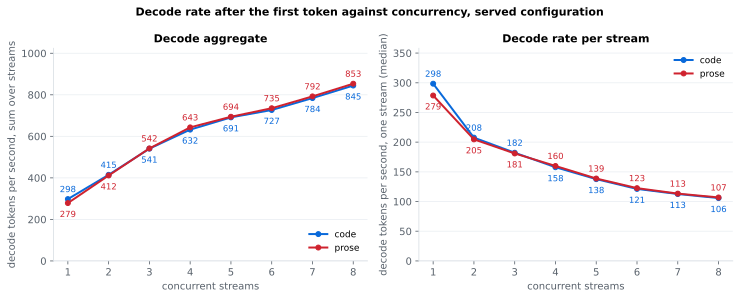
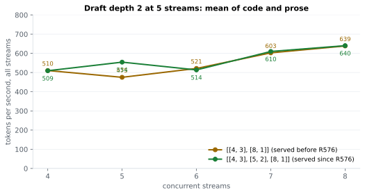
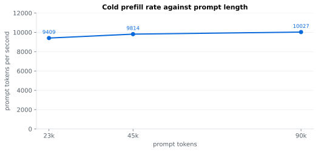

# Qwen3.8-Flash-Next on 2× RTX 5090 (ExLlamaV3 + TabbyAPI)

Serving configuration, launcher, image recipe, kernel overlays, instruments and measurements for [Qwen3.8-Flash-Next][qwen-hf], served as [r0b0tlab's 2.50 bpw EXL3 pack][ckpt-250] by [TabbyAPI][tabby] on [ExLlamaV3][exl3] v1.5.0 across two RTX 5090 cards. The window is 262,144 tokens, the KV cache is 8-bit, and vision, reasoning, tool calls, structured output and the checkpoint's own MTP draft head are all on.

Every number here was measured on one machine, on the date given, and each links the write-up that names its raw results directory. Nothing is a projection. The index of experiments is [`bench/RESULTS.md`][results], newest first.

## Numbers

Served since 2026-09-19 23:46 CEST ([R576][r576]): image `tabbyapi:ngram-prefetch-r1-gdnbf16`, 8 slots, 966,656-token page pool at 8-bit KV, layer split `[30, 30]`, MTP depth 3 up to 4 jobs, 2 at 5 jobs and 1 above, launcher [`scripts/launch-flashnext.sh`][launcher]. Decode is `fn_bench` ([`bench/probe.py`][probe]), greedy; aggregate = all streams' tokens over the round's wall time.

| | value | source |
| --- | --- | --- |
| context window | 262,144 tokens | checkpoint |
| page pool | 966,656 tokens, 15,236 B per token: 1.52 GB per 100k, 14.7 GB total | [R561][r561] |
| free VRAM after boot | 2,085 / 867 MiB; 1,299 / 353 under a cold 120k prefill plus 8 streams | [R561][r561], [R558][r558] |
| decode, 1 stream | code 202.2, prose 200.9 t/s (24 prompts each, 512 tokens) | [R575][r575] |
| decode, 4 streams | code 511, prose 508 t/s aggregate; 131 / 127 t/s per stream | [R570][r570] |
| decode, 5 streams | code 561–563, prose 541–545 t/s aggregate; 113 / 110 t/s per stream | [R570][r570], [R571][r571], [R576][r576] |
| decode, 6 streams | code 514, prose 510–514 t/s aggregate; 86 / 86 t/s per stream | [R570][r570], [R571][r571] |
| decode, 7 streams | code 611, prose 608 t/s aggregate; 88 / 88 t/s per stream | [R571][r571] |
| decode, 8 streams | code 644, prose 637 t/s aggregate; 83 / 81 t/s per stream | [R570][r570] |
| decode at depth, 1 stream | prose 197 / 196 / 193 t/s at 89 / 99,839 / 199,451 prompt tokens | [R554][r554] |
| decode, agent-shaped edit | 223.7 t/s at 1 stream; at 4 streams 502.2 aggregate, 143.1 t/s per stream | [R525][r525] |
| MTP drafts accepted per verify | code 1.57, prose 1.55 of 3 | [R572][r572] |
| cold prefill, 1 request | 9,409 / 9,814 / 10,027 t/s at 30k / 60k / 120k targets | [R574][r574] |
| TTFT, short prompt | 0.13 / 0.22 / 0.31 / 0.39 s at 1 / 2 / 3 / 4 at once; 0.26 s while 3 slots decode ~112k contexts | [R549][r549] |
| 8-agent SWE-bench replay, 366 calls | wall 408.6 s; latency p50 3.76 s; queue wait p50 0.12 s | [R558][r558], [R557][r557] |
| prompt restored from the NVMe tier after a restart | 29,952 tokens in 0.69 s (cold 3.96 s); 119,808 in 0.99 s (cold 12.33 s) | [R534][r534] |
| long-context retrieval | 5/5 needles at 131k and at 240k prompt tokens | [R548][r548], [R546][r546] |
| GSM8K 5-shot, n=500, no stop strings | 0.978 | [R565][r565] |
| [tool-eval-bench][tool-eval], 69 × 4 | 84.0 ± 2.4 | [R565][r565] |
| [SWE-bench Verified][swebench], [mini-SWE-agent][mini-swe] 2.4.6 | 46 of 49 selected instances | [R359][r359], 3.05 bpw pack |
| boot to serving | ~20 s, warm kernel caches | [R525][r525] |



Per-stream rate is nearly flat from 6 to 8 streams; the 5-stream dip is the draft policy, not contention.





Figures are drawn from the raw records in `bench/results/` by [`bench/plot.py`](bench/plot.py) (`uv run bench/plot.py`).

Also passing: structured output (`json_schema`, `response_format`, `regex_pattern`, thinking on and off, [R453][r453]); `tool_choice` `required` 48/48, named 4/4, 8/8 concurrent ([R529][r529]); a long prompt prefilled twice gives identical output ([R535][r535]).

Insights behind these numbers:

- 5 streams used to decode slower than 4: the policy dropped to 1 draft token there, because a deeper draft would exceed the 16 verify rows the fast MoE kernels take ([R560][r560], [R562][r562]). Drafting 2 tokens at 5 streams is +11 to +20 % and has been served since R576, for −2 to −3 % on 6-stream prose ([R570][r570], [R571][r571], [R576][r576]).
- Code decodes faster than prose at 1 stream because draft acceptance tracks how predictable the text is ([R572][r572]).
- 8 slots beat 4 on synthetic concurrency but not on the agent replay, which spends two thirds of its wall time at 5–7 concurrent calls ([R558][r558], [R557][r557]).
- 8-bit KV costs 0.2–0.3 accepted drafts per verify against full precision ([R572][r572]).
- GSM8K figures published here before 2026-09-18 evening (0.9158 at n=1319, 0.925, 0.935) used lm-eval's stop strings, which cut reasoning and undercount by 7–18 % of questions ([R509][r509]).

## What the stack is

- **Checkpoint**: [r0b0tlab/Qwen3.8-Flash-Next-EXL3-2.50bpw][ckpt-250], routed experts at K = 2, 3 and 4 bits. It boots a 2.18× larger pool than [turboderp's 3.05 bpw pack][ckpt-turbo] and decodes 3–8 % faster except code at c1 ([R495b][r495b]); both score the same on GSM8K ([R509][r509]).
- **Engine**: [ExLlamaV3][exl3] v1.5.0 under [TabbyAPI][tabby] `53da7919`, plus the chain in [`docker/`][docker-readme]. Every patch is opt-in by environment flag and was admitted with byte-identical greedy output, or with GSM8K, needles and tool-eval where it changes numerics:
  - [exllamav3#337][pr337]: keeps the CUDA device on the module's device during a layer-split forward ([R362][r362]).
  - multi-job QSA sparse attention and concurrency-indexed draft depth ([R341][r341], [R340][r340]).
  - the fused MoE decode path at 16 rows ([R414][r414]) and a wide stage-B tile ([R421][r421]).
  - bit-exact V2 of the hyper-connection mixer and of the fused MoE decode kernel ([R428][r428], [R460][r460]).
  - a two-card prefill pipeline without blocking host syncs ([R442][r442]).
  - the shared expert on a side CUDA stream, +3 to +7 % decode ([R490][r490]).
  - pinned draft staging, one readback per verify step and a 65,536-token draft head, +2 to +3 % decode ([R499][r499]).
  - grouped MoE prefill for every K, +16 to +21 % cold prefill ([R513][r513]).
  - one-warp launches of two small decode kernels at 1 stream and a re-gridded mixer state kernel, +1.0 to +1.1 % decode at 1 stream ([R538][r538]).
  - a 20-row ring for the QSA indexer's raw keys, bit-exact, +20 % page pool ([R546][r546]).
  - GDN recurrent state stored in bf16 with fp32 math, +5 % page pool, GSM8K 0.974 and tool-eval 86.8 ([R548][r548]).
- **Cards**: layer split, 30 GB of weights and cache per card. `qwen4_exp` raises `NotImplementedError` for tensor parallelism in this engine, so the cards take turns over their own layers and one stream keeps each card 44–47 % busy (2026-09-16, 3.05 bpw pack, [GPU duty cycle][duty]). Expert parallelism was built and measured at −9.5 % at c1 (results `2026-09-16-r408-ep-served`). Tensor parallelism was bounded before building it: from measured half-work kernel times and all-reduce costs, a TP step would be at most 1.07–1.08× faster at 1 and 4 streams (2026-09-19, [R527][r527]).
- **Speculative decoding**: the checkpoint's MTP head, depth 3 up to 4 concurrent jobs and depth 1 above (`[[4, 3], [8, 1]]`). Confidence-gated dynamic depth crashes at c4 ([R497][r497]).
- **Sampler fallbacks**: temperature 0.6, top_k 20, top_p 0.95 with `force: false`, so a client that sends its own sampler keeps it. Without a preset TabbyAPI serves sampler-less requests at temperature 1.0 untruncated ([`docs/GOTCHAS.md`][gotchas]).
- **Guard rails**: the launcher refuses to start without the checkpoint or the image, stops any other engine holding the cards, waits for them to drain and mounts the kernel caches. Every promotion re-runs the gates in [`docs/PROMOTION.md`][promotion] on the exact launcher.

## Hardware

Read from the box on 2026-09-19; every number in this README was measured in this state.

- Host: ASRock X870 Taichi Creator, AMD Ryzen 7 9800X3D, 64 GB DDR5-6000 (2 × 32 GB), Ubuntu 24.04.4 LTS, kernel 7.0.0-30-generic.
- GPUs: two RTX 5090 32 GB (`sm_120`) on PCIe Gen5 x8/x8. Power limits are the cards' defaults, 600 W (ASUS, `cuda:0`) and 575 W (HP OEM, `cuda:1`). Memory clock offset +4500 MHz on both cards, core clock stock; a boot-time service applies both.
- Driver: NVIDIA 610.57.04 open kernel modules, CUDA 13.3 user-mode driver.
- Storage: one KIOXIA KBG80ZNV2T04 2 TB NVMe (ext4) holds the checkpoint, including the 18.5 GiB n-gram embedding table that decode reads rows from, and the NVMe prefix tier. A sequential 16 MiB `O_DIRECT` read of a tier segment ran at 6.7 GB/s (2026-09-19).

## In progress (2026-09-19)

- A windowed MTP draft cache ([R569][r569], [R573][r573]): a sink page plus the last 16,384 tokens per slot frees about 930 MiB on cuda:0, the loader moves a layer there, and cuda:1 — the card that bounds the page pool — gains 1,884 MiB, which laddered to 1,015,808 tokens. Decode gains 0.2 to 1.6 % at short context and 4.7 % on a cold 100k-token prompt, and needles stay 5/5. It was promoted and [rolled back][r575] the same evening: 901 MiB of free VRAM on cuda:0 is not enough to capture a decode graph for a batch size first seen under load. The next attempt ladders with a full 1-to-8-stream ramp at each pool.
- A draft policy that keeps 5 streams inside the fast MoE decode path's 16-row limit: `[[4, 3], [5, 2], [8, 1]]` reads +17.3 % at 5 streams and −3.1 % on 6-stream prose ([R570][r570]); queued for promotion with that trade accepted.
- Upstream's tiled hyper-connection prefill mix ([`825db5b`][exl3-825db5b]) ported onto this stack behind one flag: worth +14.0 % at 60k and +11.4 % at 120k where it was measured upstream ([R568][r568]), at 302 MiB per card there and a claimed 2.1 MiB here.
- One fused kernel per layer for the GDN linear-attention decode block, claimed bit-exact; GDN is 0.80 ms of a 13.9 ms 1-stream step ([R519][r519]).
- Mixed draft depth per job inside one verify batch, so 6 and 7 streams can fill the 16-row budget the way 5 streams would.

## Measured and not served

17 to 32 verify rows on the cooperative MoE kernels, as two calls of at most 16 rows: bit-identical, and −14.5 % at 8 streams against drafting one token ([R566][r566]). Draft depth 4 at 1 stream, with or without a controller: it costs 32,768 page-pool tokens and returns at most about +2 % ([R567][r567]). Two draft chains verified together: +5 to +6.5 % more accepted tokens for twice the verify rows, modelled at −10 to −13 % ([R564][r564]). A 4,096-token prefill chunk: does not boot beside the page pool ([R574][r574]). The served stack on upstream `dev`: −49,152 pool tokens and 1–3 % decode ([R563][r563]).

Draft depth 2 above 4 jobs: −32 to −39 % at 6 and 8 streams, because 18 and 24 verify rows leave the fast MoE decode kernels (2026-09-19, [R560][r560], [R562][r562]). Prefill chunk 1,024 or 512 instead of 2,048: running streams get 1.5× the decode frames while another request prefills, but cold prefill runs at about half the rate and the new request waits 1.4–1.7× longer for its first token ([R553][r553]). The MTP draft's embedding copy on cuda:0: +16,384 pool tokens for −1.8 % code and −2.0 % prose at 1 stream ([R555][r555]). Adaptive MTP draft depth, round 2: −2.4 to −3.5 % prose at 1 stream, no gain on code ([R556][r556]). A deeper MTP draft for a single decoding job (depth 4 or 5 instead of 3), all arms at a 753,664-token pool: +4.8 / +5.2 % code and −5.4 / −8.2 % prose at 1 stream against depth 3, 16,384 / 49,152 fewer pool tokens than the served 819,200, and a different greedy output (2026-09-19, [R537][r537]). The K=3 MoE decode kernel without register spills: bit-exact, slower per call in 28 of 30 kernel cells, −0.37 % code at c1 over 8 boots with a 95 % interval of −0.83 to +0.09 % (2026-09-19, [R536][r536]). Recurrent checkpoints stored at the end of each reply are correct but save about 9k prefill tokens over a 120-call agent replay, below its run-to-run spread ([R524][r524]). A fused shared-expert kernel: after the side-stream overlap the shared expert's residual is 1.9 µs per layer at 4 rows, at most 0.6 % of a 1-stream step and 1.2 % at 4 streams ([R521][r521]); `EXL3_INT8_GEMV=0`, −0.3 % at c1 with a 95 % interval of ±1.2 % over 8 boots ([R520b][r520b]); 6 decode slots, +17 % at c6 and 9 % slower on an 8-agent replay, before bf16 GDN state halved the per-slot cost ([R518][r518]); chunk 1024 for pool ([R483][r483], [R485][r485]); split [30, 31] at 393,216 ([R487][r487]); the n-gram table in host RAM, +1–2 % for 30.5 GiB ([R484][r484]); the host KV tier ([R358][r358], [R493][r493]); GDN state replay ([R496][r496]); a 4-bit MTP graft ([R498][r498]); prompt lookup, +3–4 % on code at c1 and flat at c4 ([R501][r501]); K8V4, +18 % pool for −11 % code at c1 ([R480][r480]); CPU-offloaded experts ([R482][r482]); MoE coop mode 3 ([R462][r462]); [exllamav3#303][pr303] MTP hot vocabulary ([R377][r377]); [exllamav3#246][pr246] and [#290][pr290] ([R365][r365]); our own 32-row MoE decode envelope ([R366][r366]). The same checkpoint on vLLM through [vllm-exl3][vllm-exl3] read 0.62× the c1 and 1.06–1.12× the c4 of this stack's 3.05 bpw configuration of 2026-09-18; work on that route stopped the same day ([vLLM route][vllm-route]).

## Reproducing a boot

```sh
ssh flan 'bash -s' < scripts/launch-flashnext.sh                  # serve on :8022
PORT=8023 bash scripts/launch-flashnext.sh                        # a second instance
IMG=tabbyapi:decode-kernels-r4 EXTRA_ENV= bash scripts/launch-flashnext.sh   # an older image, patches off
STOP=1 bash scripts/launch-flashnext.sh                           # stop
```

Rebuilding the image chain, running the measurements and handing the box back are in [`docs/RUNBOOK.md`][runbook].

## Repository map

| path | what it is |
| --- | --- |
| [`scripts/launch-flashnext.sh`][launcher] | the served launcher: writes the config and the sampler preset, starts the container, warms the kernels |
| [`scripts/launchers/`][launchers] | the launcher of each promotion and experiment, for rollback and reproduction |
| [`scripts/r*.sh`][scripts] | one driver per experiment, each under the box's GPU lock |
| [`docker/`][docker-readme] | the served image layer by layer: Dockerfiles, patches, overlays with SHA-pinned installers and kernel tests |
| [`bench/RESULTS.md`][results] | index of every experiment, newest first; one file per experiment in [`bench/results/`][bench-results] with its raw records |
| [`bench/probe.py`][probe] | decode, concurrency and depth instrument (`fn_bench`): forced length via `min_tokens`, one JSONL line per request |
| [`bench/multiprompt.py`][multiprompt], [`bench/agentic-edit.py`][agentic-edit] | sampled multi-prompt decode, and agent-shaped file edits |
| [`bench/needle.py`][needle], [`bench/capabilities.py`][capabilities] | long-context retrieval at five planted positions; JSON schema, tool parsing, vision and reasoning checks |
| [`bench/nostop_proxy.py`][nostop] | drops the request's `stop` field so lm-eval's stop strings cannot cut reasoning |
| [`bench/agent_replay.py`][agent-replay], [`bench/revisit.py`][revisit] | recorded agent conversations replayed at concurrency; revisits of evicted long sessions |
| [`docs/CONFIG.md`][config] | every setting and flag, and why it has that value |
| [`docs/HISTORY.md`][history] | how the served configuration changed, with the result behind each step |
| [`docs/PROMOTION.md`][promotion] | the gates a candidate passes before it is served |
| [`docs/GOTCHAS.md`][gotchas] | the traps, as "what it looks like" against "what it is" |
| [`docs/RUNBOOK.md`][runbook] | serve, measure, rebuild and hand the box back |
| [`THIRD_PARTY.md`][third-party] | where every input came from and under which licence |
| [`CLAUDE.md`][claude-md] | the working agreement: prose rules, box rules, measurement rules |

## Attribution and licence

The original work here (documentation, instruments, launcher, overlay installers, measurements) is [MIT][license]. The model is the Qwen team's under the Qwen Community License; the checkpoints are [r0b0tlab's][ckpt-250] and [turboderp's][ckpt-turbo]; the engine is [ExLlamaV3][exl3] (MIT) and the server [TabbyAPI][tabby] (AGPL-3.0), and every kernel patch in [`docker/`][docker-readme] is a derivative of one of them. The patches were written with coding agents from static source dumps and admitted or rejected by measurement on the box. Ideas were taken from [vcruz305's DGX Spark recipe][vcruz-recipe], [DominikBucko][bucko], [HaberstrohSystems][haberstroh] and [halogen][halogen]; the full table is in [`THIRD_PARTY.md`][third-party].

## Links

Model and checkpoints: [Qwen3.8-Flash-Next][qwen-hf] · [r0b0tlab 2.50 bpw][ckpt-250] · [turboderp EXL3 packs][ckpt-turbo]

Engine and server: [ExLlamaV3][exl3] · [EXL3 conversion][exl3-convert] · [TabbyAPI][tabby] · [llguidance][llguidance]

Upstream pull requests measured here: [exllamav3#246][pr246] · [#284][pr284] · [#290][pr290] · [#299][pr299] · [#303][pr303] · [#337][pr337]

Other setups of this model: [vcruz305 DGX Spark recipe][vcruz-recipe] · [vcruz305/vllm-exl3][vllm-exl3] · [DominikBucko, 2× RTX 3090][bucko] · [HaberstrohSystems, 24 GB SGLang][haberstroh]

Benchmarks and harnesses: [tool-eval-bench][tool-eval] · [mini-SWE-agent][mini-swe] · [SWE-bench][swebench] · [lm-evaluation-harness][lm-eval] · [halogen][halogen]

[qwen-hf]: https://huggingface.co/Qwen/Qwen3.8-Flash-Next
[ckpt-250]: https://huggingface.co/r0b0tlab/Qwen3.8-Flash-Next-EXL3-2.50bpw
[ckpt-turbo]: https://huggingface.co/turboderp/Qwen3.8-Flash-Next-exl3
[exl3]: https://github.com/turboderp-org/exllamav3
[exl3-825db5b]: https://github.com/turboderp-org/exllamav3/commit/825db5b
[exl3-convert]: https://github.com/turboderp-org/exllamav3/blob/master/doc/convert.md
[tabby]: https://github.com/theroyallab/tabbyAPI
[llguidance]: https://github.com/guidance-ai/llguidance
[vllm-exl3]: https://github.com/vcruz305/vllm-exl3
[vcruz-recipe]: https://github.com/vcruz305/Qwen3.8-Flash-Next-EXL3-DGX-Spark-recipe
[bucko]: https://github.com/DominikBucko/qwen38-flash-next-2x3090
[haberstroh]: https://github.com/HaberstrohSystems/qwen3.8-flash-next-24gb-sglang
[halogen]: https://github.com/peonist-ai/halogen
[tool-eval]: https://github.com/SeraphimSerapis/tool-eval-bench
[mini-swe]: https://github.com/SWE-agent/mini-swe-agent
[swebench]: https://github.com/SWE-bench/SWE-bench
[lm-eval]: https://github.com/EleutherAI/lm-evaluation-harness
[pr246]: https://github.com/turboderp-org/exllamav3/pull/246
[pr284]: https://github.com/turboderp-org/exllamav3/pull/284
[pr290]: https://github.com/turboderp-org/exllamav3/pull/290
[pr299]: https://github.com/turboderp-org/exllamav3/pull/299
[pr303]: https://github.com/turboderp-org/exllamav3/pull/303
[pr337]: https://github.com/turboderp-org/exllamav3/pull/337

[launcher]: scripts/launch-flashnext.sh
[launchers]: scripts/launchers/
[scripts]: scripts/
[r521-driver]: scripts/r521-shared-bound.sh
[r522-driver]: scripts/r522-mtp-pruned.sh
[r523-driver]: scripts/r523-tool-choice.sh
[r524-driver]: scripts/r524-recurrent-tip.sh
[docker-readme]: docker/README.md
[results]: bench/RESULTS.md
[bench-results]: bench/results/
[probe]: bench/probe.py
[multiprompt]: bench/multiprompt.py
[agentic-edit]: bench/agentic-edit.py
[needle]: bench/needle.py
[capabilities]: bench/capabilities.py
[nostop]: bench/nostop_proxy.py
[agent-replay]: bench/agent_replay.py
[revisit]: bench/revisit.py
[config]: docs/CONFIG.md
[config-memory]: docs/CONFIG.md#memory
[history]: docs/HISTORY.md
[promotion]: docs/PROMOTION.md
[gotchas]: docs/GOTCHAS.md
[runbook]: docs/RUNBOOK.md
[third-party]: THIRD_PARTY.md
[claude-md]: CLAUDE.md
[license]: LICENSE

[agent-cost]: bench/results/swebench-agent-cost.md
[duty]: bench/results/gpu-duty-cycle.md
[vllm-route]: bench/results/vllm-exl3-route.md
[r340]: bench/results/r340-ci-depth.md
[r341]: bench/results/r341-qsa.md
[r358]: bench/results/r358-hostkv.md
[r359]: bench/results/r359-swebench.md
[r362]: bench/results/r362-pr337.md
[r365]: bench/results/r365-kernels.md
[r366]: bench/results/r366-ourkernel.md
[r377]: bench/results/r377-hotvocab-on.md
[r414]: bench/results/r414-bszn16.md
[r421]: bench/results/r421-coopwide-ab.md
[r428]: bench/results/r428-hcmix2-stack-ab.md
[r442]: bench/results/r442-ppipe.md
[r453]: bench/results/r453-exl3-structured.md
[r460]: bench/results/r460-moecoop-v2-ab.md
[r462]: bench/results/r462-moecoop-v3-ab.md
[r480]: bench/results/r480-exl3-pool.md
[r482]: bench/results/r482-cold-experts.md
[r483]: bench/results/r483-exl3-pool-chunk.md
[r484]: bench/results/r484-ngram-ram.md
[r485]: bench/results/r485-pool-frontier.md
[r487]: bench/results/r487-pool-393k.md
[r490]: bench/results/r490-shared-overlap.md
[r492]: bench/results/r492-depth.md
[r493]: bench/results/r493-host-kv-tier.md
[r495b]: bench/results/r495b-2p50-audition.md
[r496]: bench/results/r496-gdn-state-r3.md
[r497]: bench/results/r497-draft-confidence.md
[r498]: bench/results/r498-mtp4-graft.md
[r499]: bench/results/r499-decode-r4.md
[r501]: bench/results/r501-prompt-lookup.md
[r509]: bench/results/r509-gsm8k-nostop.md
[r511]: bench/results/r511-promote-2p50.md
[r513]: bench/results/r513-prefill-e3-r2.md
[r516]: bench/results/r516-int8-mixer-pool.md
[r517]: bench/results/r517-promote-stack.md
[r525]: bench/results/r525-promote-int8mix.md
[r528]: bench/results/r528-promote-mtp-pruned.md
[r529]: bench/results/r529-promote-tool-choice.md
[r527]: bench/results/r527-tp-bound.md
[r530]: bench/results/r530-promote-plefix.md
[r524]: bench/results/r524-recurrent-tip.md
[r526]: bench/results/r526-nvme-tier.md
[r532]: bench/results/r532-nvme-tier-r4.md
[r533]: bench/results/r533-e3-det-precise.md
[r534]: bench/results/r534-promote-nvme-tier.md
[r535]: bench/results/r535-promote-e3det.md
[r536]: bench/results/r536-nospill.md
[r537]: bench/results/r537-draft-depth.md
[r538]: bench/results/r538-decode-r6.md
[r540]: bench/results/r540-promote-r6.md
[r546]: bench/results/r546-promote-rawk.md
[r548]: bench/results/r548-promote-gdnbf16-ring.md
[r549]: bench/results/r549-hot-slots.md
[r552b]: bench/results/r552b-c4-stream-count.md
[r553]: bench/results/r553-chunk-hot-stall.md
[r554]: bench/results/r554-depth-decode.md
[r555]: bench/results/r555-headdev-mirror.md
[r556]: bench/results/r556-adaptive-draft-r2.md
[r557]: bench/results/r557-agent-replay-daily.md
[r558]: bench/results/r558-slots8.md
[r560]: bench/results/r560-c8-policy.md
[r561]: bench/results/r561-promote-slots8.md
[r562]: bench/results/r562-profile-c8.md
[r559]: bench/results/r559-ngram-prefetch.md
[r565]: bench/results/r565-promote-ngram-prefetch.md
[r563]: bench/results/r563-rebase-dev.md
[r564]: bench/results/r564-draft-topk.md
[r566]: bench/results/r566-moe-rows32.md
[r567]: bench/results/r567-adaptive-draft-r3.md
[r568]: bench/results/r568-rebase-prefill.md
[r569]: bench/results/r569-mtp-kv-window.md
[r570]: bench/results/r570-c5-draft-policy.md
[r571]: bench/results/r570-c5-draft-policy.md
[r572]: bench/results/r572-mtp-acceptance.md
[r573]: bench/results/r573-mtp-kv-window-screen.md
[r574]: bench/results/r574-chunk4096.md
[r575]: bench/results/r575-promote-mtp-kv-window.md
[r576]: bench/results/r576-promote-c5-policy.md
[hot-slots]: bench/hot_slots.py
[r521]: bench/results/r521-shared-bound.md
[r522]: bench/results/r522-mtp-pruned.md
[r528-driver]: scripts/r528-promote-mtp-pruned.sh
[r522b-driver]: scripts/r522b-mtp-pruned-precise.sh
[r526-driver]: scripts/r526-nvme-tier.sh
[r518]: bench/results/r518-slots6.md
[r519]: bench/results/r519-profile-2p50.md
[r520]: bench/results/r520-int8gemv.md
[r520b]: bench/results/r520b-int8gemv-precise.md
