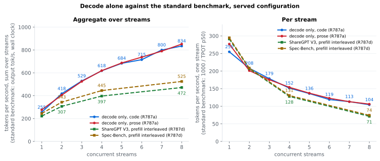
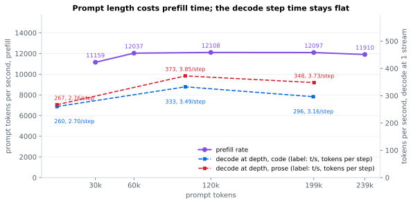
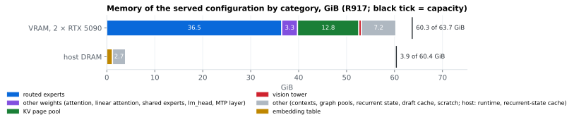

# Qwen3.8-Flash-Next on 2× RTX 5090 (ExLlamaV3 + TabbyAPI)

Serving configuration, launcher, image recipe, kernel overlays, instruments and measurements for [Qwen3.8-Flash-Next][qwen-hf] on two RTX 5090 cards.

**Goal**: serve coding agents from one desktop box. Several agent sessions run at once against it, their prompts grow with every tool call up to the 262k window, and each session waits on decode. The 8 slots, the KV pool size, the draft policy and the benchmarks below (an 8-agent SWE-bench replay, agent traffic with prompts arriving during decode) follow from that workload.

- **Checkpoint**: [r0b0tlab's 2.50 bpw EXL3 pack][ckpt-250].
- **Engine**: [ExLlamaV3][exl3] `dev` `5783a93` (v1.5.2) plus a chain of 19 patch sets carried on top, one of them upstream PR #337 and the rest written for this repository (sources in [`THIRD_PARTY.md`](THIRD_PARTY.md)): MoE decode kernels, the hyper-connection mixer, MTP drafting and verify, prompt lookup, prefill, and recurrent-state and KV memory ([What the stack is](#what-the-stack-is), [`docker/`][docker-readme]).
- **Server**: [TabbyAPI][tabby] `53da7919` with patches written here for tokenization and loop detection; image `tabbyapi:r828-prompt-lookup-r3`, 47 launcher selectors.
- **Window and KV pool**: 262,144 tokens per request; an 8-bit KV page pool of 901,120 tokens (13.7 GB) shared by 8 slots ([R784][r784]).
- **Enabled**: vision, reasoning, tool calls, structured output, the checkpoint's own MTP draft head, and prompt lookup, which keeps the MTP opener and copies a prior-context tail at actual batch one after sustained-copy probation.
- **Code edits at 1 stream**: 414.44 / 414.99 t/s per-stream median, greedy with thinking off, 2,048 forced output tokens on 1,832–8,646-token prompts, measured 2026-10-02 in [R828][r828], results `2026-10-02-r828-prompt-lookup-r3-em6iO4`.

Every number here was measured on one machine on the date given, and each links the write-up that names its raw results directory. None is an estimate. The index of experiments is [`bench/RESULTS.md`][results], newest first.

## Numbers

Measured on the served configuration ([R826][r826], 2026-10-01, results `2026-10-01-r826-std-ab`): one short prompt per stream, greedy, 1,024 forced tokens, all streams starting together. Decode rate is tokens per second after a request's first token; decode aggregate is the sum over the streams running together ([How the numbers are measured](#how-the-numbers-are-measured)).



- Solid lines: decode alone. Dashed lines: `vllm bench serve` on ShareGPT and Spec-Bench, with new requests' prefill interleaved ([Standard benchmark](#standard-benchmark-vllm-bench-serve)).
- At 8 streams: 844 / 859 t/s decode aggregate (code / prose); 523.9 / 568.3 tok/s wall-clock output on ShareGPT / Spec-Bench.
- Time to the first token: 0.13 s at 1 stream, 0.70 to 0.73 s at 8.
- Agent traffic, with prompts arriving during decode, decodes slower per stream ([Conditions](#conditions)).



- Cold prefill: 199,425 tokens in 16.5 s, 239,110 in 20.1 s ([R787b][r787], 2026-09-27).
- Decode on an already-filled context: 10.3 to 10.7 ms per step up to about 200k tokens ([R787c][r787]).

| | value | source |
| --- | --- | --- |
| context window | 262,144 tokens | checkpoint |
| page pool | 901,120 tokens, 15,236 B per token: 1.52 GB per 100k, 13.7 GB total | [R784][r784], [R579][r579], [R717c][r717] |
| free VRAM after boot and the boot warm-up | 1,099 / 1,667 MiB | [R818p][r815] |
| decode, code-file edit, greedy, thinking off (2026-10-02) | 1 stream, 2,048 forced output tokens, 1,832–8,646-token prompts: 414.44 / 414.99 t/s per-stream median across two boots | [R828][r828], results `2026-10-02-r828-prompt-lookup-r3-em6iO4` |
| MTP drafts accepted per verify | code 1.57, prose 1.55 of 3 | [R572][r572] |
| 8-agent SWE-bench replay, 366 calls | wall 408.6 s; latency p50 3.76 s; queue wait p50 0.12 s | [R558][r558], [R557][r557] |
| prompt restored from the NVMe tier after a restart | 29,952 tokens in 0.69 s (cold 3.96 s); 119,808 in 0.99 s (cold 12.33 s) | [R534][r534] |
| long-context retrieval | 5/5 needles at 105,680 and at 193,464 prompt tokens (the 131k and 240k settings), 2026-09-29 | [R810][r809], [R548][r548], [R546][r546] |
| GSM8K 5-shot, n=500, no stop strings | 0.978, 8 concurrent, 2026-09-29 | [R809][r809] |
| [tool-eval-bench][tool-eval], 69 × 4 | 85.0 ± 2.4, 2026-09-29 | [R809][r809] |
| [SWE-bench Verified][swebench], all 500, [mini-SWE-agent][mini-swe] 2.4.6, task containers without network | 397 resolved (79.4 %); 7 ended without a patch, 2 of them on server errors | [R586, R586d][r586] |
| boot to serving | ~20 s, warm kernel caches | [R525][r525] |

Also passing: structured output (`json_schema`, `response_format`, `regex_pattern`, thinking on and off, [R453][r453]); `tool_choice` `required` 48/48, named 4/4, 8/8 concurrent ([R529][r529]); a long prompt prefilled twice gives identical output ([R535][r535]).

### Conditions

- **Charts.** R826 ran with prompt lookup inactive, a 901,120-token pool and memory clock offset +4500, 19:34 to 23:16 UTC, on two NEW boots with the served boot warm-up. The code and prose prompts are 118 and 106 tokens; R828's c1–c3 repeats recorded zero active lookup on them ([R828][r828]). On the dashed lines, aggregate is wall-clock output tok/s and the per-stream rate is 1000 / TPOT p50; ShareGPT at 4 streams is the mean of the main and c4-repeat four boots. Decode aggregate rises from 1 to 8 streams, including 5 to 6 (code 689 to 726 t/s, prose 697 to 739), and a decode step yields 2.27 to 2.34 tokens at 5 to 8 streams, median per request ([R826][r826]). The prefill chart was measured on `tabbyapi:rebase-dev-r3`, the base image under the served image's TabbyAPI and prefill layers; the decode rate at depth rises because the draft is accepted more often on the text after the filler: 2.70 / 2.76 tokens per decode step at the start (code / prose), 3.16 to 3.85 at 100k to 200k ([R787c][r787]).
- **Agent traffic.** On the same server, one 3,000-token generation at ~10k context decodes at 236 t/s after its first token alone, 154 while fresh ~45k-token prompts arrive every 8 seconds, and 141 with two other long generations running (2026-09-20). Sampling at temperature 0.6 costs a further 0 to 24 % ([R584, R585][r585]). A 45k-token prompt is 22 chunks of 2,048 tokens, and each chunk is a forward pass in which the running streams do not decode; context depth and generation length do not account for the loss ([R583][r583]).
- **Draft depth.** The served policy drafts three tokens up to 4 streams and two at 5 to 8 streams; at 6 to 8 streams that is 18 to 24 verify rows, which the 17-to-32-row decode paths take in one launch ([R717, R717c][r717]).
- **Code and prose.** Each kind is one short prompt with a distinct suffix per stream, greedy, 1,024 forced tokens; lookup never activates on R828's c1–c3 repeats of these fn prompts ([R828][r828]). Prose decodes 8.5 % faster per stream than code at 1 stream and 1.5 % faster at 8 streams ([R826][r826], 2026-10-01, results `2026-10-01-r826-std-ab`); at 1 stream code yields 2.59 tokens per decode step and prose 2.82, at the same time per step.
- **Slots.** 8 slots raise throughput over 4 on synthetic concurrency but not on the agent replay, which spends two thirds of its wall time at 5–7 concurrent calls ([R558][r558], [R557][r557]).
- **KV precision.** 8-bit KV costs 0.2–0.3 accepted drafts per verify against full precision ([R572][r572]).
- **Page pool.** The pool is bounded by whichever card holds more of the 12 full-attention layers ([R579][r579]). The `gpu_split` budget does not move the boundary, and the decode graphs take 790 MiB on the bounding card ([R581][r581]).

## Memory

Measured 2026-10-08 on the served configuration after its boot warm-up ([R917](bench/results/r917-flashnext-memory-layout.md)). Weights come from the checkpoint's tensor sizes, the page pool from its measured bytes per token; the VRAM total comes from `nvidia-smi` and the host total from the container's memory cgroup (anonymous plus shared memory, without the page cache); "other" is the measured total minus the listed items.



## Served configuration

- Since 2026-10-02 19:10 UTC ([R828c][r828]): image `tabbyapi:r828-prompt-lookup-r3`, 47 launcher selectors including `EXL3_PROMPT_LOOKUP=1`, the served engine stack on upstream ExLlamaV3 `dev` `5783a93` (v1.5.2) with upstream's tiled hyper-connection prefill mix (`EXL3_GR_MIX_TILED=1`), TabbyAPI's loop patch in its fifth round, one encode per prompt, off the event loop above 12,000 characters ([`tokenize-offloop-r2`](docker/overlays/tokenize-offloop-r2/README.md)), the prefill leftover merged into the last forward with the recurrent stash copied asynchronously (`EXL3_PREFILL_MERGE=1`, `EXL3_STASH_ASYNC=1`, [`prefill-merge-r1`](docker/overlays/prefill-merge-r1/README.md)), and recurrent-state checkpoints every 4,096 tokens within the last 12,288 tokens of each prompt, captured inside the pipelined prefill forward ([`r823c-cachetail-inforward`](docker/overlays/r823c-cachetail-inforward/README.md)), with a resumable whole-prompt prefill window that yields between chunks ([R824–R825p](bench/results/r825-whole-prompt-window.md)). Launcher [`scripts/launch-flashnext.sh`][launcher]. Its patches are listed under [What the stack is](#what-the-stack-is) and in [`docker/`][docker-readme]; each promotion is a row in [`docs/HISTORY.md`](docs/HISTORY.md), and every setting is explained in [`docs/CONFIG.md`](docs/CONFIG.md).
- 8 slots, 901,120-token page pool, 8-bit KV.
- MTP draft depth 3 up to 4 jobs and 2 at 5 to 8 jobs (`[[4, 3], [8, 2]]`); the draft cache is page-indexed over the whole pool on the second GPU.
- Layer split `[30, 30]`, with the MTP draft component on the second GPU ([R694][r694]).
- Boot warm-up since 2026-09-30 13:52 CEST ([R818p][r815]): after boot the launcher sends three raw completions of 20, 29 and 11 prompt tokens, which run the routed-MoE decode path for up to 32 rows at new row counts and put the process in the faster decode state at 1 and 2 streams; output unchanged. `FASTWARM=0` skips it.
- Recurrent checkpoint selectors: `EXL3_RECURRENT_CHECKPOINT_INTERVAL_PP=4096`, `EXL3_RECURRENT_CHECKPOINT_TAIL_PP=12288`, `EXL3_RECURRENT_CHECKPOINT_INFORWARD=1`.
- Whole-prompt selectors: `EXL3_PREFILL_WHOLE_PROMPT=1`, `EXL3_PREFILL_RESUMABLE=1`.
- Prompt lookup: `EXL3_PROMPT_LOOKUP=1`, only at actual batch one after at least 24 hit rounds, 50% hit density and 90% copied-tail acceptance in a 64-round probation window ([R828][r828]).
- Cache trace on (`EXL3_CACHE_TRACE=1` from the image); NVMe prefix tier off by default (`NVME_TIER=`).

## What the stack is

- **Checkpoint**: [r0b0tlab/Qwen3.8-Flash-Next-EXL3-2.50bpw][ckpt-250], routed experts at K = 2, 3 and 4 bits. It boots a 2.18× larger pool than [turboderp's 3.05 bpw pack][ckpt-turbo] and decodes 3–8 % faster except code at c1 ([R495b][r495b]); both score the same on GSM8K ([R509][r509]).
- **Engine**: [ExLlamaV3][exl3] `dev` `5783a93` (v1.5.2) under [TabbyAPI][tabby] `53da7919`, with the chain in [`docker/`][docker-readme] ported onto it. The gains listed below were measured on v1.5.0, before the port. Every patch is opt-in by environment flag and was admitted with byte-identical greedy output, or with GSM8K, needles and tool-eval where it changes numerics:
  - [exllamav3#337][pr337]: keeps the CUDA device on the module's device during a layer-split forward ([R362][r362]).
  - multi-job QSA sparse attention and concurrency-indexed draft depth ([R341][r341], [R340][r340]).
  - the fused MoE decode path at 16 rows ([R414][r414]) and a wide stage-B tile ([R421][r421]).
  - bit-exact V2 of the hyper-connection mixer and of the fused MoE decode kernel ([R428][r428], [R460][r460]).
  - a two-card prefill pipeline without blocking host syncs ([R442][r442]).
  - the shared expert on a side CUDA stream, +3 to +7 % decode ([R490][r490]).
  - pinned draft staging, one readback per verify step and a 65,536-token draft head, +2 to +3 % decode ([R499][r499]).
  - grouped MoE prefill for every K, +16 to +21 % cold prefill ([R513][r513]).
  - one-warp launches of two small decode kernels at 1 stream and a re-gridded mixer state kernel, +1.0 to +1.1 % decode at 1 stream ([R538][r538]).
  - a 20-row ring for the QSA indexer's raw keys, bit-exact, +20 % page pool ([R546][r546]).
  - GDN recurrent state stored in bf16 with fp32 math, +5 % page pool, GSM8K 0.974 and tool-eval 86.8 ([R548][r548]).
  - a batched draft verifier, one verify call for all jobs, +1 to +4 % decode ([R646][r646]).
  - the MTP input-norm fusion, a fused int8 state-in-up mixer kernel and grouped MTP accept-prefill batching, +4.4 % decode at 8 streams, byte-identical output ([R653][r653]).
  - a slot returned to the recurrent-state pool when state construction fails ([R676][r676]).
  - the MTP draft component loaded on the second GPU (`draft_gpu_split: [0, 32]`), +2.0 to +2.9 % prose decode at 1 to 8 streams and +2.2 % at 26k context, mean of three alternating pairs, greedy output identical ([R694][r694]).
  - the hyper-connection mixer's int8 kernels with each weight converted once per iteration, the loads batched and the reduction as a reduce-scatter ([R698, R699][r698]), and the routed-expert MoE decode kernels with a cp.async weight ring, an activation prefetch and one counter arrival per item ([R700b][r700b]); both bitwise-identical: 1.051 to 1.093 times the per-stream prose decode rate at 1 to 8 streams and 1.064 times at 26k context ([R701][r701]).
  - a second batch of bitwise-identical decode changes: the mixer kernels' round 2 with per-row-count tiles ([R702][r702]); the Gated-DeltaNet recurrence held in registers, the QSA indexer as a parallel CUDA-graph branch and compile options for the QSA split and combine kernels ([R712][r712]); V2 twins of the dense K=4 decode GEMM, mgemm and gemv kernels ([R714][r714]); the round-2 MoE decode kernels with the shared expert forked before the router ([R713][r713]); together 1.149, 1.088 and 1.087 times the per-stream prose decode rate at 1, 4 and 8 streams at about 4k tokens of context and 1.104 times at 26k tokens and 4 streams, logits identical at every served decode shape ([R716b, R716c][r716b]).
  - decode paths for 17 to 32 rows (the routed-expert MoE decode in one launch, the shared expert and the dense GEMMs at 32 rows), so that 6 to 8 jobs verify at draft depth 2 instead of 1; host code only, each MoE output at 17 to 32 rows equal to two 16-row calls. With the policy `[[4, 3], [8, 2]]` about +3 % per-stream decode (0 to +6 % across cells) at 6 and 8 streams on prompts of 12,000 to 44,000 tokens, up to +16 to +21 % at 6 streams with 4k context; 1 to 5 streams unchanged ([R717, R717b, R717c][r717]).
  - the whole chain ported onto upstream `dev` `5783a93`, bringing upstream's tiled hyper-connection prefill mix ([`825db5b`][exl3-825db5b]), fp16 GDN prefill projections and a deterministic router GEMM; greedy output differs from the chain on v1.5.0. Cold prefill 1.134× at 90k tokens, page pool −8.3 % ([R784][r784]); agent-replay decode 1.015× in one session ([R786][r786]).
- **Cards**: layer split, 30 GB of weights and cache per card. `qwen4_exp` raises `NotImplementedError` for tensor parallelism in this engine, so the cards take turns over their own layers, and one stream keeps each card 44–47 % busy (2026-09-16, 3.05 bpw pack, [GPU duty cycle][duty]). Expert parallelism was built and measured at −9.5 % at 1 stream (results `2026-09-16-r408-ep-served`). Tensor parallelism was bounded before it was built: from measured half-work kernel times and all-reduce costs, a TP step would be at most 1.07–1.08× faster at 1 and 4 streams (2026-09-19, [R527][r527]).
- **Speculative decoding**: the checkpoint's MTP head, depth 3 up to 4 concurrent jobs and depth 2 at 5 to 8 (`[[4, 3], [8, 2]]`, [R717c][r717]); at actual batch one, adaptive lookup can supply the tail after the MTP opener, preserving the verify width and skipping tail draft forwards on all-hit rounds ([R828][r828]).
- **Sampler fallbacks**: temperature 1.0, top_k 20, top_p 0.95 (the model card's thinking-mode values) with `force: false`, so a client that sends its own sampler keeps it. Without a preset TabbyAPI serves sampler-less requests untruncated (top_k 0, top_p 1.0) ([`docs/GOTCHAS.md`][gotchas]).
- **Loop detection**: TabbyAPI's default window of 800 tokens. A loop in the thinking of a chat request forces `</think>`, and the model answers or calls a tool ([R783][r783]); three more detectors on the thinking end periods of up to 1,000, 2,000 and 4,000 tokens after three copies ([R792][r792], [`loop-think-r5`](docker/overlays/loop-think-r5/README.md)). A tool call cut by `max_tokens` finishes as `length`.
- **Tokenization**: TabbyAPI encodes each prompt once per request, reusing the context-length check's ids for the job. A prompt longer than 12,000 characters is encoded on a one-thread worker through the tokenizer's `encode_batch`, which releases the GIL, so the running streams keep decoding while it is encoded; a shorter one is encoded inline ([R808][r808], [`tokenize-offloop-r2`](docker/overlays/tokenize-offloop-r2/README.md)).
- **Prefill**: a prompt is prefilled in forwards of up to 2,048 rows. When the rest of the prompt fits one forward, the rows after its last full 256-token page run in that forward, and each recurrent layer splits at the page boundary inside it so that the state there is stashed for the next turn's reuse; each recurrent stash is copied to the host through pinned staging buffers on a worker thread. Greedy output changes on prompts whose prefill merges; the change was gated against the variation another prefill partition of the same prompt produces; measurements in [R803-R810][r809] ([`prefill-merge-r1`](docker/overlays/prefill-merge-r1/README.md)).
- **Guard rails**: the launcher refuses to start without the checkpoint or the image, stops any other engine holding the cards, waits for them to drain and mounts the kernel caches. Every promotion re-runs the gates in [`docs/PROMOTION.md`][promotion] on the exact launcher.

## Hardware

Read from the box on 2026-09-19. Every number in this README was measured on this hardware and driver; the memory clock offset is stated per period below.

- Host: ASRock X870 Taichi Creator, AMD Ryzen 7 9800X3D, 64 GB DDR5-6000 (2 × 32 GB), Ubuntu 24.04.4 LTS, kernel 7.0.0-30-generic.
- GPUs: two RTX 5090 32 GB (`sm_120`) on PCIe Gen5 x8/x8. Power limits are the cards' defaults, 600 W (ASUS, `cuda:0`) and 575 W (HP OEM, `cuda:1`). Memory clock offset +4500 MHz on both cards, core clock stock. A boot-time service applies them once per host boot, and since 2026-09-25 the launcher sets the memory offset before every engine boot and logs the readback. The offset had reset to 0 between 2026-09-03 and 2026-09-19 without a reboot, so the numbers measured from 2026-09-19 to 2026-09-25 02:22 UTC ran at the stock memory clock; +4500 is +14.3 % DRAM bandwidth and +1.7 to +1.8 % decode per stream at 1 stream ([R726][r726]).
- Driver: NVIDIA 610.57.04 open kernel modules, CUDA 13.3 user-mode driver.
- Storage: one KIOXIA KBG80ZNV2T04 2 TB NVMe (ext4) holds the checkpoint, including the 18.5 GiB n-gram embedding table that decode reads rows from, and the NVMe prefix tier. A sequential 16 MiB `O_DIRECT` read of a tier segment ran at 6.7 GB/s (2026-09-19).

## Measured and not served

Each entry names the change and the number that kept it out of the served configuration. c1, c4 and c6 mean 1, 4 and 6 concurrent streams.

- A windowed MTP draft cache, a sink page plus the last 16,384 tokens per slot (in the image, off): +3.4 % page pool ([R579][r579]), but a prompt revived from the prompt cache in a later request group drafts 0.655 accepted per proposed token against 0.868 without it, and an agent-shaped replay decodes 2.0 % faster per stream without it ([R728][r728]).
- Mixed draft depth per job inside one verify batch, so 5 to 7 streams fill the 16 verify rows: 0.79× at 5 streams and 0.84× at 7, code, 256 forced tokens, greedy. The verify window grows to the deepest job in the batch, which adds a sequential draft level to every step ([R678b][r678b]).
- 17 to 32 verify rows on the cooperative MoE kernels, as two calls of at most 16 rows: bit-identical, −14.5 % at 8 streams against drafting one token ([R566][r566]). One launch of up to 32 rows is served since 2026-09-25 ([R717][r717]).
- Draft depth 2 above 4 jobs on the 16-row decode paths: −32 to −39 % at 6 and 8 streams, because 18 and 24 verify rows fell off the cooperative MoE decode kernels (2026-09-19, [R560][r560], [R562][r562]). With the rows32 paths depth 2 at 6 to 8 jobs is served since 2026-09-25 ([R717][r717]).
- Draft depth 4 at 1 stream, with or without a controller: costs 32,768 page-pool tokens and returns at most about +2 % ([R567][r567]).
- A deeper MTP draft for a single decoding job (depth 4 or 5 instead of 3), all arms at a 753,664-token pool: +4.8 / +5.2 % code and −5.4 / −8.2 % prose at 1 stream against depth 3, 16,384 / 49,152 fewer pool tokens than the served 819,200 of that date, and a different greedy output (2026-09-19, [R537][r537]).
- Adaptive MTP draft depth, round 2: −2.4 to −3.5 % prose at 1 stream, no gain on code ([R556][r556]).
- Two draft chains verified together: +5 to +6.5 % accepted tokens for twice the verify rows, modelled at −10 to −13 % ([R564][r564]).
- A 4,096-token prefill chunk: does not boot beside the page pool ([R574][r574]).
- Prefill chunk 1,024 or 512 instead of 2,048: running streams get 1.5× the decode frames while another request prefills, but cold prefill runs at about half the rate and the new request waits 1.4–1.7× longer for its first token ([R553][r553]). Chunk 1,024 for pool size: [R483][r483], [R485][r485].
- The served stack on upstream `dev` `1d64111`: −49,152 pool tokens and 1–3 % decode ([R563][r563]). A later port onto `dev` `5783a93` is served since 2026-09-27, at −81,920 pool tokens ([R784][r784]).
- The MTP draft's embedding copy on cuda:0: +16,384 pool tokens for −1.8 % code and −2.0 % prose at 1 stream ([R555][r555]).
- The K=3 MoE decode kernel without register spills: bit-exact, slower per call in 28 of 30 kernel cells, −0.37 % code at c1 over 8 boots with a 95 % interval of −0.83 to +0.09 % (2026-09-19, [R536][r536]).
- Recurrent checkpoints stored at the end of each reply: correct, but they save about 9k prefill tokens over a 120-call agent replay, below its run-to-run spread ([R524][r524]).
- A fused shared-expert kernel: after the side-stream overlap the shared expert's residual is 1.9 µs per layer at 4 rows, at most 0.6 % of a 1-stream step and 1.2 % at 4 streams ([R521][r521]).
- `EXL3_INT8_GEMV=0`: −0.3 % at c1 with a 95 % interval of ±1.2 % over 8 boots ([R520b][r520b]).
- 6 decode slots: +17 % at c6 and 9 % slower on an 8-agent replay, measured before the bf16 GDN state halved the per-slot cost ([R518][r518]).
- Split [30, 31] at 393,216 ([R487][r487]).
- The n-gram table in host RAM: +1–2 % for 30.5 GiB ([R484][r484]).
- The host KV tier ([R358][r358], [R493][r493]); GDN state replay ([R496][r496]); a 4-bit MTP graft ([R498][r498]); CPU-offloaded experts ([R482][r482]); MoE coop mode 3 ([R462][r462]).
- Prompt lookup: +3–4 % on code at c1, flat at c4 ([R501][r501]).
- K8V4: +18 % pool for −11 % code at c1 ([R480][r480]).
- [exllamav3#303][pr303] MTP hot vocabulary ([R377][r377]); [exllamav3#246][pr246] and [#290][pr290] ([R365][r365]); a 32-row MoE decode envelope written for this stack ([R366][r366]).
- The same checkpoint on vLLM through [vllm-exl3][vllm-exl3]: 0.62× the c1 and 1.06–1.12× the c4 of this stack's 3.05 bpw configuration of 2026-09-18. Work on that route stopped the same day ([vLLM route][vllm-route]).

## How the numbers are measured

**Decode** ([R826][r826], 2026-10-01, results `2026-10-01-r826-std-ab`, driver [`scripts/r826-std-ab.sh`](scripts/r826-std-ab.sh), R813's measurement loop): `fn_bench` ([`bench/probe.py`][probe]) against `tabbyapi:r825c-hostprepare`, launcher `262e9c31`, 46 selectors, memory clock offset +4500, two NEW boots with the served boot warm-up, greedy, 1,024 forced tokens (`min_tokens`), one unrecorded warm-up round and three recorded rounds per shape, NVMe tier off. `--distinct` gives each stream its own suffix; prompts are 118 tokens for code and 106 for prose, with no cached prefix reuse. The two NEW boots differ by at most 2.48 % per cell on per-stream decode rate and 3.07 % on decode aggregate.

- **Decode rate per stream**: the median over requests of (tokens − 1) / (time of the last token − time of the first token).
- **Decode aggregate**: the mean over rounds of the sum of the decode rates of requests running together. At 2 to 8 streams every stream decodes during 90.7 to 98.9 % of the round's mean decode window, so the sum overstates the rate sustained together by at most about 10 %.
- **End-to-end burst aggregate**: all streams' tokens over the round's wall time, including time to the first token and the tail after the first stream finishes.

| streams | decode per stream, t/s, code / prose | decode aggregate, t/s, code / prose | time to first token, s, code / prose | end-to-end burst aggregate, t/s, code / prose |
| ---: | ---: | ---: | ---: | ---: |
| 1 | 264.8 / 287.4 | 265 / 287 | 0.13 / 0.13 | 256 / 278 |
| 2 | 215.3 / 209.3 | 432 / 418 | 0.23 / 0.22 | 408 / 391 |
| 3 | 179.3 / 176.1 | 537 / 529 | 0.34 / 0.32 | 498 / 495 |
| 4 | 153.4 / 156.0 | 626 / 629 | 0.45 / 0.44 | 561 / 578 |
| 5 | 137.7 / 139.1 | 689 / 697 | 0.55 / 0.53 | 630 / 642 |
| 6 | 120.1 / 122.7 | 726 / 739 | 0.62 / 0.58 | 663 / 680 |
| 7 | 114.7 / 115.1 | 811 / 808 | 0.68 / 0.63 | 729 / 740 |
| 8 | 105.3 / 106.8 | 844 / 859 | 0.73 / 0.70 | 770 / 774 |

**Prefill** ([R787b][r787], 2026-09-27 15:23 to 15:27 UTC, results `2026-09-27-r787b-prefill-curve`, R580's protocol, on `tabbyapi:rebase-dev-r3`, the base image under the served image's TabbyAPI and prefill layers): three salted cold prompts per target, counted by the server, NVMe tier off; 11,159 to 12,108 t/s from 29,932 to 239,110 tokens, 1.13 to 1.16× [R580][r580]'s rates of 2026-09-20, which ran on an older image at the stock memory clock ([R726][r726]). The decode-at-depth points are [R787c][r787] (same image, results `2026-09-27-r787c-depth-decode`, R554's probe with the code targets moved to about 100k and 200k tokens, where [R554][r554]'s landed at 180k): 1 stream, 2,048 forced greedy tokens, the mean of the cold and the cached run. Time per decode step is decode seconds over streamed frames, one frame per verify step:

| prompt tokens, code / prose | decode, t/s, code / prose | tokens per decode step, code / prose | ms per decode step, code / prose |
| ---: | ---: | ---: | ---: |
| 101 / 89 | 260 / 267 | 2.70 / 2.76 | 10.4 / 10.4 |
| 99,812 / 99,724 | 333 / 373 | 3.49 / 3.85 | 10.5 / 10.3 |
| 199,083 / 199,735 | 296 / 348 | 3.16 / 3.73 | 10.7 / 10.7 |

Figures are drawn from the raw records in `bench/results/` by [`bench/plot.py`](bench/plot.py) (`uv run bench/plot.py`).

## Standard benchmark (`vllm bench serve`)

[vLLM][vllm]'s serving benchmark v0.30.0 on [ShareGPT V3][sharegpt] and [Spec-Bench][spec-bench], run against the served configuration through [`bench/vllm_bench_tabby.py`][vllm-bench-tabby] ([R826][r826], 2026-10-01 19:34 to 23:16 UTC, results `2026-10-01-r826-std-ab`, driver [`scripts/r826-std-ab.sh`](scripts/r826-std-ab.sh), R811's matrix and R731b's sample). Output tok/s is all completion tokens over wall time from the first request's start to the last completion, closed loop at `c` concurrent requests, including prefill, time to the first token and request turnover. The headline decode metrics in [Numbers](#numbers) exclude these costs; a per-stream rate multiplied by concurrency is not an aggregate.

Conditions: `tabbyapi:r825c-hostprepare`, launcher `262e9c31`, 46 selectors, stock power limits 600 / 575 W, core offset 0, memory offset +4500, NVMe tier off. Each cell boots fresh with the served boot warm-up; R826 has 15,680 standard requests including OLD and c4-repeat, with 0 cached prompt tokens. The matrix runs passes A and B in balanced arm order. NEW cells are the two-pass mean, ShareGPT at 4 streams the mean of all four main and c4-repeat NEW boots; p99 columns give the runs' range. Each concurrency sends the same sample: ShareGPT 400 conversations, seed 7310, and all 480 Spec-Bench questions in 13 categories. Input lengths have mean 272 / 322 and maximum 1,070 / 1,540 tokens (ShareGPT / Spec-Bench). Greedy requests have thinking on; `min_tokens` forces the ShareGPT reference output length (mean 210 tokens) or 256 tokens for Spec-Bench, so outputs are truncated reasoning.

In the figure at the top, standard-benchmark per-stream rates at 1 and 2 streams are ShareGPT / Spec-Bench 298 / 298 and 212 / 216 t/s, against code / prose decode-only rates 265 / 287 and 215 / 209. At 4 streams they read 133 / 137 against 153 / 156, and at 8 streams 77 / 79 against 105 / 107. New requests' prefill interleaves with running streams' decode, and shorter outputs put more of each request's life in TTFT and turnover. At 1 stream the decode-only prompts yield 2.59 / 2.82 tokens per step (code / prose), while the standard sample's server τ is 2.66 / 2.87 (ShareGPT / Spec-Bench). Both panels and the tables below are drawn from R826's published raw records by `bench/plot.py`.

**ShareGPT V3**

| streams | output tok/s (wall clock) | A/B spread | req/s | TTFT p50 / p99 (ms) | TPOT p50 / p99 (ms) | per-stream tok/s (1000 / TPOT p50) | E2E p50 (s) | τ |
| ---: | ---: | ---: | ---: | ---: | ---: | ---: | ---: | ---: |
| 1 | 231.5 | 1.06 % | 1.10 | 136 / 250–255 | 3.36 / 4.43–4.48 | 298 | 0.60 | 2.66 |
| 2 | 324.8 | 2.28 % | 1.54 | 193 / 331–383 | 4.71 / 7.95–8.22 | 212 | 0.85 | 2.65 |
| 4 | 426.6 | 417.7–435.2 (4 boots) | 2.03 | 250 / 542–652 | 7.49 / 17.57–17.93 | 133 | 1.27 | 2.64 |
| 8 | 523.9 | 0.79 % | 2.49 | 307 / 918–1,096 | 12.97 / 20.87–22.78 | 77 | 1.98 | 2.31 |

**Spec-Bench**

| streams | output tok/s (wall clock) | A/B spread | req/s | TTFT p50 / p99 (ms) | TPOT p50 / p99 (ms) | per-stream tok/s (1000 / TPOT p50) | E2E p50 (s) | τ |
| ---: | ---: | ---: | ---: | ---: | ---: | ---: | ---: | ---: |
| 1 | 253.2 | 2.17 % | 0.99 | 130 / 251–323 | 3.36 / 4.28–4.33 | 298 | 1.01 | 2.87 |
| 2 | 364.8 | 0.02 % | 1.43 | 180 / 382–394 | 4.64 / 6.02–6.06 | 216 | 1.38 | 2.88 |
| 4 | 471.4 | 3.26 % | 1.84 | 240 / 565–618 | 7.32 / 9.34–10.27 | 137 | 2.14 | 2.87 |
| 8 | 568.3 | 5.36 % | 2.22 | 322 / 763–959 | 12.62 / 15.37–16.27 | 79 | 3.54 | 2.43 |

The same-session OLD arm is `tabbyapi:merge-tok-r1`, launcher `6429dfa2`, 41 selectors. At 1 and 2 streams the ratio of NEW / OLD output-throughput means is 1.027 / 1.022 on ShareGPT and 1.033 / 1.038 on Spec-Bench; standard ITL p50 ratios are 0.969 to 0.975. The main c4/c8 throughput differences are smaller than each cell's maximum within-arm A/B spread. ShareGPT c4's unconditional four-boot mean reads 0.985× OLD, with two slow and two fast NEW boots against one slow and three fast OLD boots; the mode-matched main passes read 1.000 / 0.999. Spec-Bench c2 mean TTFT reads 0.954× OLD, with pass ratios 0.928 / 0.981. The paired tables, generation-identity limits and warm-up attribution are in [R826][r826]; the earlier merge-layer comparison is in [R811 to R813][r811].

- TTFT is client-side time to the first streamed token, the first reasoning token with thinking on.
- TPOT is (E2E − TTFT) / (output tokens − 1) per request and includes waits for other requests' prefills. The per-stream column is the mean of each boot's 1000 / TPOT p50; it differs from `fn_bench`'s per-request decode rate.
- τ is server-log Σ generated / (Σ generated − Σ accepted drafts), including the prefill step; it is about 1 % low and falls above 4 streams when draft depth becomes two. Spec-Bench τ differs from acceptance figures published with Spec-Bench.
- A/B spread is |A − B| / mean within this run. ShareGPT c4 instead retains all four NEW boots, range 417.7 to 435.2 tok/s, under R811b's composite rule; its four-boot spread is 4.10 %, and its TPOT p99 ranges from 17.57 to 17.93 ms. Spec-Bench c4 and c8 A/B spreads are 3.26 % and 5.36 %; these measured means carry that variation ([R826][r826]).
- Every R826 cell reaches its forced output total, 84,120 tokens for ShareGPT and 122,880 for Spec-Bench, with no failed request or early loop-detector finish.
- vLLM's `max_concurrent_requests` and `max_output_tokens_per_s` fields are unused: the first counts requests touching a one-second bucket, the second counts streamed frames per second.

## Reproducing a boot

```sh
# tabbyapi:rebase-dev-r3, published 2026-09-27 (its layers plus one label-only layer)
docker pull ghcr.io/adrienbrault/qwen3.8-flash-next-2x-rtx5090@sha256:5fecdc9d8a30eb29c197f0a1e2c5af54bff65d603c4bc1ea7541b57c3ff19a32
docker tag  ghcr.io/adrienbrault/qwen3.8-flash-next-2x-rtx5090@sha256:5fecdc9d8a30eb29c197f0a1e2c5af54bff65d603c4bc1ea7541b57c3ff19a32 tabbyapi:rebase-dev-r3
# the served image = that tag plus the loop-think r5 layer, the tokenize-offloop r2 layer (the rollback image) and the prefill-merge r1
# layer (CPU only, a minute or two each); the served image was built with the last two in the other order, same installed files
docker build -f docker/overlays/loop-think-r5/Dockerfile.box --build-arg BASE=tabbyapi:rebase-dev-r3 \
  --label local.loopthink.base_id=$(docker image inspect tabbyapi:rebase-dev-r3 --format '{{.Id}}') \
  --label local.loopthink.patch_sha256=$(cat docker/overlays/loop-think-r5/fix.patch docker/overlays/loop-think-r5/r4-to-r5.patch | sha256sum | cut -c1-64) \
  -t tabbyapi:rebase-dev-r3-loopthink5 docker/overlays/loop-think-r5
docker build -f docker/overlays/tokenize-offloop-r2/Dockerfile.box --build-arg BASE=tabbyapi:rebase-dev-r3-loopthink5 \
  --build-arg BASE_ID=$(docker image inspect tabbyapi:rebase-dev-r3-loopthink5 --format '{{.Id}}') \
  --label local.tokoffloop.patch_sha256=$(cd docker/overlays/tokenize-offloop-r2 && cat exl3.patch app.patch SHA256SUMS.tests | sha256sum | cut -c1-64) \
  -t tabbyapi:tokenize-offloop-r2 docker/overlays/tokenize-offloop-r2
docker build -f docker/overlays/prefill-merge-r1/Dockerfile.box --build-arg BASE=tabbyapi:tokenize-offloop-r2 \
  --build-arg BASE_ID=$(docker image inspect tabbyapi:tokenize-offloop-r2 --format '{{.Id}}') \
  --label local.prefillmerge.patch_sha256=$(sha256sum < docker/overlays/prefill-merge-r1/fix.patch | cut -c1-64) \
  -t tabbyapi:merge-tok-r1 docker/overlays/prefill-merge-r1

ssh flan 'bash -s' < scripts/launch-flashnext.sh                  # serve on :8022
PORT=8023 bash scripts/launch-flashnext.sh                        # a second instance
IMG=tabbyapi:decode-kernels-r4 EXTRA_ENV= bash scripts/launch-flashnext.sh   # an older image, patches off
STOP=1 bash scripts/launch-flashnext.sh                           # stop
```

Rebuilding the image chain, running the measurements and handing the box back are in [`docs/RUNBOOK.md`][runbook].

## Repository map

| path | what it is |
| --- | --- |
| [`scripts/launch-flashnext.sh`][launcher] | the served launcher: writes the config and the sampler preset, starts the container, warms the kernels |
| [`scripts/launchers/`][launchers] | the launcher of each promotion and experiment, for rollback and reproduction |
| [`scripts/r*.sh`][scripts] | one driver per experiment, each under the box's GPU lock |
| [`docker/`][docker-readme] | the served image layer by layer: Dockerfiles, patches, overlays with SHA-pinned installers and kernel tests |
| [`bench/RESULTS.md`][results] | index of every experiment, newest first; one file per experiment in [`bench/results/`][bench-results] with its raw records |
| [`bench/probe.py`][probe] | decode, concurrency and depth instrument (`fn_bench`): forced length via `min_tokens`, one JSONL line per request |
| [`bench/multiprompt.py`][multiprompt], [`bench/agentic-edit.py`][agentic-edit] | sampled multi-prompt decode, and agent-shaped file edits |
| [`bench/needle.py`][needle], [`bench/capabilities.py`][capabilities] | long-context retrieval at five planted positions; JSON schema, tool parsing, vision and reasoning checks |
| [`bench/nostop_proxy.py`][nostop] | drops the request's `stop` field so lm-eval's stop strings cannot cut reasoning |
| [`bench/agent_replay.py`][agent-replay], [`bench/revisit.py`][revisit] | recorded agent conversations replayed at concurrency; revisits of evicted long sessions |
| [`bench/vllm_bench_tabby.py`][vllm-bench-tabby], [`bench/std_bench_summary.py`][std-bench-summary] | `vllm bench serve` v0.30.0 adapted to TabbyAPI (usage frame, CRLF events, `min_tokens`, Spec-Bench templated once); the tables and checks of a standard-benchmark run |
| [`docs/CONFIG.md`][config] | every setting and flag, and why it has that value |
| [`docs/HISTORY.md`][history] | how the served configuration changed, with the result behind each step |
| [`docs/PROMOTION.md`][promotion] | the gates a candidate passes before it is served |
| [`docs/GOTCHAS.md`][gotchas] | the traps, as "what it looks like" against "what it is" |
| [`docs/RUNBOOK.md`][runbook] | serve, measure, rebuild and hand the box back |
| [`THIRD_PARTY.md`][third-party] | where every input came from and under which licence |
| [`CLAUDE.md`][claude-md] | the working agreement: prose rules, box rules, measurement rules |

## Attribution and licence

The original work here (documentation, instruments, launcher, overlay installers, measurements) is [MIT][license]. The model is the Qwen team's under the Qwen Community License; the checkpoints are [r0b0tlab's][ckpt-250] and [turboderp's][ckpt-turbo]; the engine is [ExLlamaV3][exl3] (MIT) and the server [TabbyAPI][tabby] (AGPL-3.0), and every kernel patch in [`docker/`][docker-readme] is a derivative of one of them. The patches were written with coding agents from static source dumps and admitted or rejected by measurement on the box. Ideas were taken from [vcruz305's DGX Spark recipe][vcruz-recipe], [DominikBucko][bucko], [HaberstrohSystems][haberstroh] and [halogen][halogen]; the full table is in [`THIRD_PARTY.md`][third-party].

## Links

Model and checkpoints: [Qwen3.8-Flash-Next][qwen-hf] · [r0b0tlab 2.50 bpw][ckpt-250] · [turboderp EXL3 packs][ckpt-turbo]

Engine and server: [ExLlamaV3][exl3] · [EXL3 conversion][exl3-convert] · [TabbyAPI][tabby] · [llguidance][llguidance]

Upstream pull requests measured here: [exllamav3#246][pr246] · [#284][pr284] · [#290][pr290] · [#299][pr299] · [#303][pr303] · [#337][pr337]

Other setups of this model: [vcruz305 DGX Spark recipe][vcruz-recipe] · [vcruz305/vllm-exl3][vllm-exl3] · [DominikBucko, 2× RTX 3090][bucko] · [HaberstrohSystems, 24 GB SGLang][haberstroh]

Benchmarks and harnesses: [tool-eval-bench][tool-eval] · [mini-SWE-agent][mini-swe] · [SWE-bench][swebench] · [lm-evaluation-harness][lm-eval] · [halogen][halogen] · [vLLM][vllm] (`vllm bench serve`) · [ShareGPT V3][sharegpt] · [Spec-Bench][spec-bench]

[qwen-hf]: https://huggingface.co/Qwen/Qwen3.8-Flash-Next
[ckpt-250]: https://huggingface.co/r0b0tlab/Qwen3.8-Flash-Next-EXL3-2.50bpw
[ckpt-turbo]: https://huggingface.co/turboderp/Qwen3.8-Flash-Next-exl3
[exl3]: https://github.com/turboderp-org/exllamav3
[exl3-825db5b]: https://github.com/turboderp-org/exllamav3/commit/825db5b
[exl3-convert]: https://github.com/turboderp-org/exllamav3/blob/master/doc/convert.md
[tabby]: https://github.com/theroyallab/tabbyAPI
[llguidance]: https://github.com/guidance-ai/llguidance
[vllm-exl3]: https://github.com/vcruz305/vllm-exl3
[vcruz-recipe]: https://github.com/vcruz305/Qwen3.8-Flash-Next-EXL3-DGX-Spark-recipe
[bucko]: https://github.com/DominikBucko/qwen38-flash-next-2x3090
[haberstroh]: https://github.com/HaberstrohSystems/qwen3.8-flash-next-24gb-sglang
[halogen]: https://github.com/peonist-ai/halogen
[tool-eval]: https://github.com/SeraphimSerapis/tool-eval-bench
[mini-swe]: https://github.com/SWE-agent/mini-swe-agent
[swebench]: https://github.com/SWE-bench/SWE-bench
[lm-eval]: https://github.com/EleutherAI/lm-evaluation-harness
[vllm]: https://github.com/vllm-project/vllm
[sharegpt]: https://huggingface.co/datasets/anon8231489123/ShareGPT_Vicuna_unfiltered
[spec-bench]: https://github.com/hemingkx/Spec-Bench
[pr246]: https://github.com/turboderp-org/exllamav3/pull/246
[pr284]: https://github.com/turboderp-org/exllamav3/pull/284
[pr290]: https://github.com/turboderp-org/exllamav3/pull/290
[pr299]: https://github.com/turboderp-org/exllamav3/pull/299
[pr303]: https://github.com/turboderp-org/exllamav3/pull/303
[pr337]: https://github.com/turboderp-org/exllamav3/pull/337

[launcher]: scripts/launch-flashnext.sh
[launchers]: scripts/launchers/
[scripts]: scripts/
[r521-driver]: scripts/r521-shared-bound.sh
[r522-driver]: scripts/r522-mtp-pruned.sh
[r523-driver]: scripts/r523-tool-choice.sh
[r524-driver]: scripts/r524-recurrent-tip.sh
[docker-readme]: docker/README.md
[results]: bench/RESULTS.md
[bench-results]: bench/results/
[probe]: bench/probe.py
[multiprompt]: bench/multiprompt.py
[agentic-edit]: bench/agentic-edit.py
[needle]: bench/needle.py
[capabilities]: bench/capabilities.py
[nostop]: bench/nostop_proxy.py
[agent-replay]: bench/agent_replay.py
[revisit]: bench/revisit.py
[vllm-bench-tabby]: bench/vllm_bench_tabby.py
[std-bench-summary]: bench/std_bench_summary.py
[config]: docs/CONFIG.md
[config-memory]: docs/CONFIG.md#memory
[history]: docs/HISTORY.md
[promotion]: docs/PROMOTION.md
[gotchas]: docs/GOTCHAS.md
[runbook]: docs/RUNBOOK.md
[third-party]: THIRD_PARTY.md
[claude-md]: CLAUDE.md
[license]: LICENSE

[agent-cost]: bench/results/swebench-agent-cost.md
[duty]: bench/results/gpu-duty-cycle.md
[vllm-route]: bench/results/vllm-exl3-route.md
[r340]: bench/results/r340-ci-depth.md
[r341]: bench/results/r341-qsa.md
[r358]: bench/results/r358-hostkv.md
[r359]: bench/results/r359-swebench.md
[r362]: bench/results/r362-pr337.md
[r365]: bench/results/r365-kernels.md
[r366]: bench/results/r366-ourkernel.md
[r377]: bench/results/r377-hotvocab-on.md
[r414]: bench/results/r414-bszn16.md
[r421]: bench/results/r421-coopwide-ab.md
[r428]: bench/results/r428-hcmix2-stack-ab.md
[r442]: bench/results/r442-ppipe.md
[r453]: bench/results/r453-exl3-structured.md
[r460]: bench/results/r460-moecoop-v2-ab.md
[r462]: bench/results/r462-moecoop-v3-ab.md
[r480]: bench/results/r480-exl3-pool.md
[r482]: bench/results/r482-cold-experts.md
[r483]: bench/results/r483-exl3-pool-chunk.md
[r484]: bench/results/r484-ngram-ram.md
[r485]: bench/results/r485-pool-frontier.md
[r487]: bench/results/r487-pool-393k.md
[r490]: bench/results/r490-shared-overlap.md
[r492]: bench/results/r492-depth.md
[r493]: bench/results/r493-host-kv-tier.md
[r495b]: bench/results/r495b-2p50-audition.md
[r496]: bench/results/r496-gdn-state-r3.md
[r497]: bench/results/r497-draft-confidence.md
[r498]: bench/results/r498-mtp4-graft.md
[r499]: bench/results/r499-decode-r4.md
[r501]: bench/results/r501-prompt-lookup.md
[r509]: bench/results/r509-gsm8k-nostop.md
[r511]: bench/results/r511-promote-2p50.md
[r513]: bench/results/r513-prefill-e3-r2.md
[r516]: bench/results/r516-int8-mixer-pool.md
[r517]: bench/results/r517-promote-stack.md
[r525]: bench/results/r525-promote-int8mix.md
[r528]: bench/results/r528-promote-mtp-pruned.md
[r529]: bench/results/r529-promote-tool-choice.md
[r527]: bench/results/r527-tp-bound.md
[r530]: bench/results/r530-promote-plefix.md
[r524]: bench/results/r524-recurrent-tip.md
[r526]: bench/results/r526-nvme-tier.md
[r532]: bench/results/r532-nvme-tier-r4.md
[r533]: bench/results/r533-e3-det-precise.md
[r534]: bench/results/r534-promote-nvme-tier.md
[r535]: bench/results/r535-promote-e3det.md
[r536]: bench/results/r536-nospill.md
[r537]: bench/results/r537-draft-depth.md
[r538]: bench/results/r538-decode-r6.md
[r540]: bench/results/r540-promote-r6.md
[r546]: bench/results/r546-promote-rawk.md
[r548]: bench/results/r548-promote-gdnbf16-ring.md
[r549]: bench/results/r549-hot-slots.md
[r552b]: bench/results/r552b-c4-stream-count.md
[r553]: bench/results/r553-chunk-hot-stall.md
[r554]: bench/results/r554-depth-decode.md
[r555]: bench/results/r555-headdev-mirror.md
[r556]: bench/results/r556-adaptive-draft-r2.md
[r557]: bench/results/r557-agent-replay-daily.md
[r558]: bench/results/r558-slots8.md
[r560]: bench/results/r560-c8-policy.md
[r561]: bench/results/r561-promote-slots8.md
[r562]: bench/results/r562-profile-c8.md
[r559]: bench/results/r559-ngram-prefetch.md
[r565]: bench/results/r565-promote-ngram-prefetch.md
[r563]: bench/results/r563-rebase-dev.md
[r564]: bench/results/r564-draft-topk.md
[r566]: bench/results/r566-moe-rows32.md
[r567]: bench/results/r567-adaptive-draft-r3.md
[r568]: bench/results/r568-rebase-prefill.md
[r569]: bench/results/r569-mtp-kv-window.md
[r570]: bench/results/r570-c5-draft-policy.md
[r571]: bench/results/r570-c5-draft-policy.md
[r572]: bench/results/r572-mtp-acceptance.md
[r573]: bench/results/r573-mtp-kv-window-screen.md
[r574]: bench/results/r574-chunk4096.md
[r575]: bench/results/r575-promote-mtp-kv-window.md
[r579]: bench/results/r579-promote-mtp-kv-window.md
[r580]: bench/results/r580-decode-curve.md
[r704]: bench/results/r704-decode-curve.md
[r719]: bench/results/r719-decode-curve.md
[r719b]: bench/results/r719b-decode-curve.md
[r731b]: bench/results/r731b-std-bench.md
[r726]: bench/results/r726-memoc.md
[r728]: bench/results/r728-promote-window-off.md
[r783]: bench/results/r783-loopthink.md
[r587]: bench/results/r587-tabby-metrics.md
[r583]: bench/results/r583-long-generation.md
[r585]: bench/results/r585-prefill-interference.md
[r784]: bench/results/r784-rebase-dev-r3.md
[r786]: bench/results/r786-replay-abba.md
[r787]: bench/results/r787-bench-refresh.md
[r811]: bench/results/r811-r813-std-bench-merge.md
[r792]: bench/results/r792-promote-loopthink5.md
[r808]: bench/results/r805-r808-tokenize-offloop.md
[r809]: bench/results/r803-r810-prefill-merge.md
[r581]: bench/results/r581-split-rebalance.md
[hot-slots]: bench/hot_slots.py
[r521]: bench/results/r521-shared-bound.md
[r522]: bench/results/r522-mtp-pruned.md
[r528-driver]: scripts/r528-promote-mtp-pruned.sh
[r522b-driver]: scripts/r522b-mtp-pruned-precise.sh
[r526-driver]: scripts/r526-nvme-tier.sh
[r518]: bench/results/r518-slots6.md
[r519]: bench/results/r519-profile-2p50.md
[r520]: bench/results/r520-int8gemv.md
[r520b]: bench/results/r520b-int8gemv-precise.md
[r646]: bench/results/r646-verifybatch.md
[r653]: bench/results/r653-stack.md
[r676]: bench/results/r676-slotfix.md
[r694]: bench/results/r694-mtp-card1.md
[r678b]: bench/results/r678b-fill16.md
[r698]: bench/results/r698-hcfast.md
[r700b]: bench/results/r700b-moefast.md
[r701]: bench/results/r701-stack-r2.md
[r702]: bench/results/r702-hcfast-r2.md
[r712]: bench/results/r712-latchain-r1.md
[r713]: bench/results/r713-moefast-r3.md
[r714]: bench/results/r714-densegemm-r2.md
[r716b]: bench/results/r716b-stack-r3.md
[r717]: bench/results/r717-rows32.md
[r586]: bench/results/r586-swebench-500.md
[r815]: bench/results/r815-r820-fast-state.md
[r823]: bench/results/r823-tail-checkpoints.md

[r826]: bench/results/r826-std-ab.md

[r828]: bench/results/r827-r828-prompt-lookup.md
